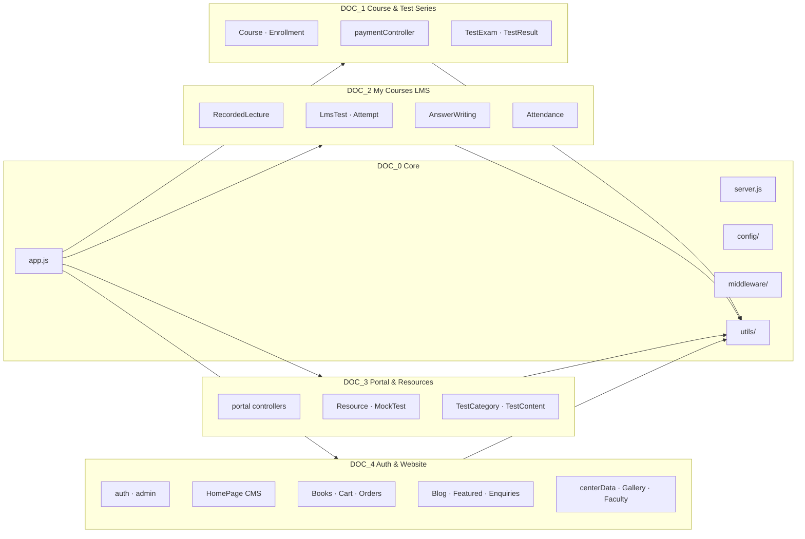
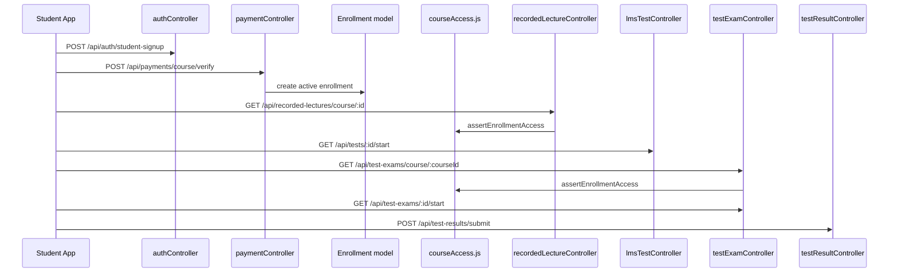
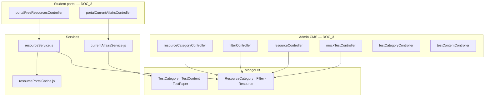
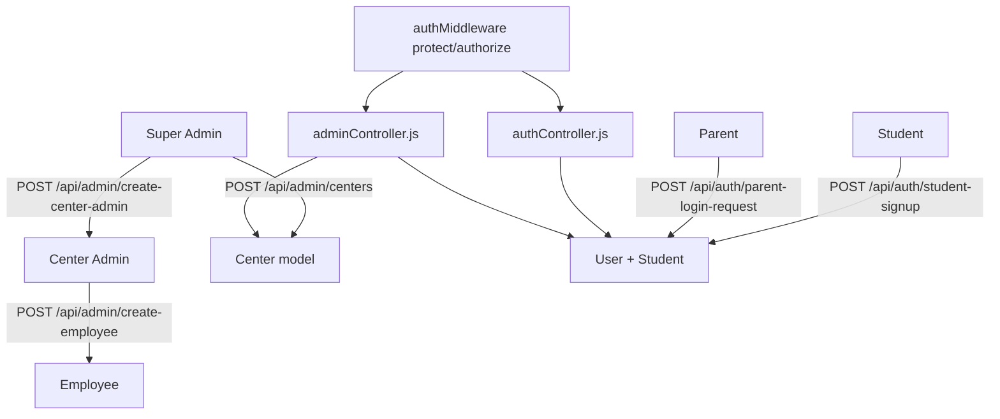

# Sriram-IAS Backend — Architecture & File Interconnection Flow

> **Generated:** 2026-05-23  
> Regenerate with `node scripts/generate-complete-code-docs.js`

This diagram shows how the backend layers connect. Each box is a **folder or module**; arrows show the typical request/data flow.

---

## 1. High-level request flow

```mermaid
flowchart TB
  subgraph Client
    WEB[Website / Admin Panel / Student App]
  end

  subgraph Entry["DOC_0 — Entry"]
    SRV[server.js]
    APP[app.js]
    CFG[config/db.js · razorpay.js · cloudinary.js]
  end

  subgraph MW["DOC_0 — Middleware"]
    AUTH_MW[authMiddleware.js · protect / authorize]
    VAL[validation.js]
    UP[upload*.js → Cloudinary]
  end

  subgraph Routes["Routes layer — 50 route files"]
    R_AUTH[/api/auth]
    R_ADMIN[/api/admin]
    R_COURSE[/api/courses]
    R_PAY[/api/payments]
    R_LMS[/api/recorded-lectures · /api/tests]
    R_TS[/api/test-exams · /api/test-results]
    R_PORTAL[/api/portal/*]
    R_RES[/api/resources/*]
    R_HOME[/api/homepage]
    R_BOOK[/api/books · /api/cart]
  end

  subgraph Controllers["Controllers — business logic"]
    CTRL[57 controller files]
  end

  subgraph Services["Services — portal read layer"]
    RS[resourceService.js]
    CA[currentAffairsService.js]
  end

  subgraph Data["Models — MongoDB"]
    MONGO[(Mongoose models — 72 schemas)]
  end

  subgraph Utils["DOC_0 — Shared utils"]
    U_ACCESS[courseAccess.js]
    U_OTP[otpService.js · emailService.js]
    U_HELPERS[lmsTestHelpers · testExamHelpers · ...]
  end

  WEB --> SRV
  SRV --> APP
  APP --> CFG
  APP --> AUTH_MW
  AUTH_MW --> Routes
  Routes --> VAL
  Routes --> UP
  Routes --> Controllers
  Controllers --> Services
  Controllers --> Utils
  Services --> Utils
  Controllers --> Data
  Services --> Data
  Utils --> Data
```

---

## 2. Module domains (which DOC volume)



---

## 3. Student journey (enrollment → learning → test series)



---

## 4. Portal vs CMS (free resources & current affairs)



---

## 5. Auth & admin hierarchy



---

## 6. File dependency cheat sheet

| If you change… | Also check… |
|----------------|-------------|
| `models/Enrollment.js` | `utils/courseAccess.js`, `paymentController.js` |
| `models/Course.js` | `courseController.js`, `publicRoutes.js` |
| `models/TestExam.js` | `testExamController.js`, `testExamHelpers.js` |
| `models/ResourceCategory.js` | `resourceService.js`, `resourceCategoryController.js` |
| `models/TestCategory.js` | `currentAffairsService.js`, portal routes |
| `app.js` (new route) | New `routes/*.js` + `controllers/*.js` + this generator bucket |
| `middleware/authMiddleware.js` | Every protected route file |

---

## 7. Documentation volumes (100% codebase coverage)

| Volume | File count | Covers |
|--------|------------|--------|
| DOC_0 | Infrastructure | server, app, config, middleware, utils, fix scripts |
| DOC_1 | Course & payments & test series | |
| DOC_2 | My Courses LMS | |
| DOC_3 | Portal + resources CMS | |
| DOC_4 | Auth, admin, homepage, commerce, content | |

**Total:** All `.js` files in the repository are embedded in exactly one volume (verified by generator).

