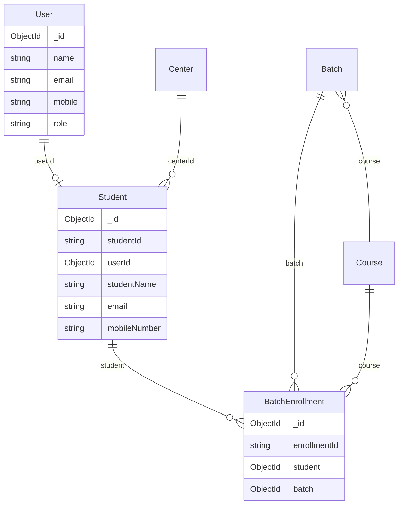

# Unified Student Management Architecture

## Problem (before)

Two separate student concepts existed:

| Collection | Used by |
|------------|---------|
| `Student` | Signup + Admin create (linked to `User`) |
| `AcademicStudent` | Batch enrollment ERP only |

Batch enrollments referenced `AcademicStudent`, so students created via signup/admin were **not** visible in batch `students[]`.

## Solution (now)

**Single collection:** `students` (`Student` model)

```
User (portal login)  ←──optional──→  Student (ERP master)
                                      ↑
BatchEnrollment.student ──────────────┘
```

---

## Schema: `Student`

| Field | Notes |
|-------|--------|
| `studentId` | `STU001` (auto) |
| `userId` | Ref `User`, optional until signup links batch-only student |
| `studentName` | Display name (required) |
| `email` | Unique among active students (sparse) |
| `mobileNumber` | Unique among active students (sparse) |
| `centerId` | Ref `Center` |
| `parentName`, `parentEmail`, `parentMobile` | Parent info |
| `status` | `ACTIVE` / `INACTIVE` |
| `isDeleted`, `deletedAt` | Soft delete |

---

## Service: `utils/studentService.js`

| Function | Purpose |
|----------|---------|
| `findStudentByEmailOrMobile` | Dedup lookup |
| `createStudentProfile` | Create student row |
| `findOrCreateStudentForEnrollment` | Batch enrollment flow |
| `ensureStudentProfileForUser` | Signup verify — link or create |
| `createStudentWithUser` | Admin `POST /api/admin/users` with `userType: STUDENT` |

---

## Flows

### 1. Student signup
1. `POST /api/auth/student-signup` → creates inactive `User`
2. `POST /api/auth/verify-student-signup` → activates `User`, calls `ensureStudentProfileForUser`
3. If student already exists from batch enrollment (same email/mobile), **links** `userId` instead of duplicating

### 2. Admin create student
`POST /api/admin/users` with `userType: "STUDENT"`:
- Creates `User`
- Creates `Student` with `userId`, `studentId`, email, mobile, parent fields
- Duplicate check on **both** `User` and `Student` contact fields

### 3. Admin create other roles
`userType: <roleId>` → `AdminAccess` only (no `Student`)

### 4. Batch enrollment
`POST /api/batch-enrollments`:
- `findOrCreateStudentForEnrollment` by email/mobile
- Creates enrollment with `student: Student._id`

### 5. Batch details
`GET /api/batches/:id` → `students[]` from `BatchEnrollment` populated from **`Student`** collection

---

## Relationship diagram



---

## Migration (optional legacy data)

Old test data in `academicstudents` is **not** auto-migrated.

If needed:

```bash
node scripts/migrate-academic-students-to-students.js
```

Then update enrollment `student` refs manually if they still point to old ObjectIds (or re-enroll).

**Recommended for production:** ignore old test enrollments; all **new** enrollments use unified `Student`.

---

## Deprecated

- `models/AcademicStudent.js` — no longer used by application code
- `generateAcademicStudentId` — alias of `generateStudentId`
